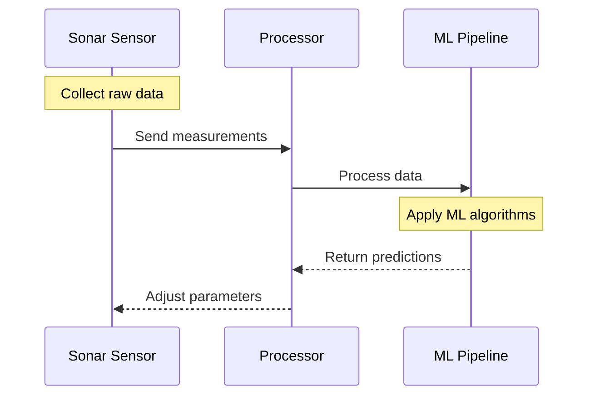
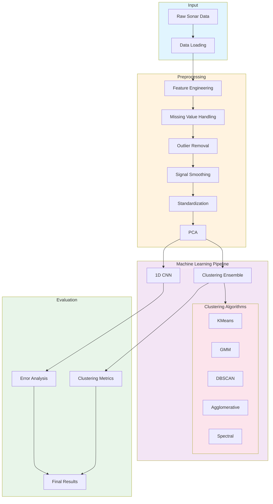
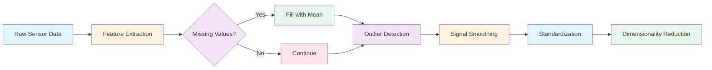
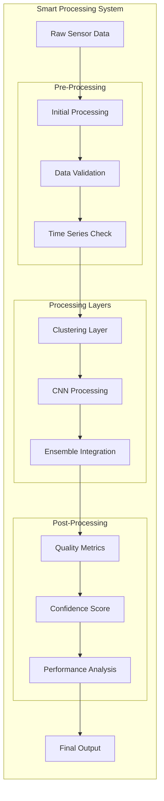
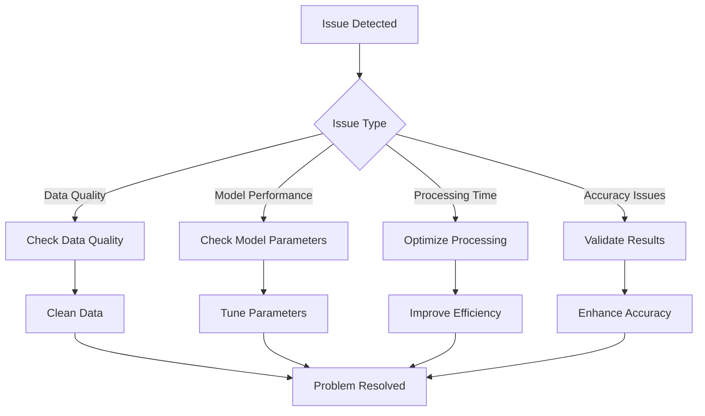

<div align="center">
<h2>Advanced Machine Learning Solution for Sonar Sensor Data Processing</h2>
<p>Created by: Md Khairul Islam</p>
<p>Hobart and William Smith Colleges</p>
<p>Double major in Robotics and Computer Science</p>
</div>

## Table of Contents
- [Overview](#overview)
- [System Architecture](#system-architecture)
- [Data Processing Pipeline](#data-processing-pipeline)
- [Machine Learning Implementation](#machine-learning-implementation)
- [Signal Processing](#signal-processing)
- [Performance Analysis](#performance-analysis)
- [Installation](#installation)
- [Usage](#usage)
- [Troubleshooting](#troubleshooting)

## Overview
This project implements sophisticated machine learning techniques to enhance sonar sensor accuracy, specifically addressing the challenge of distinguishing between actual objects and small holes through ensemble clustering and deep learning approaches.

### Basic Operating Principles


## System Architecture



## Data Processing Pipeline



## Machine Learning Implementation

### Neural Network Architecture

```mermaid
flowchart LR
    A[Input Layer] --> B[Conv1D]
    B --> C[MaxPool1D]
    C --> D[Conv1D]
    D --> E[MaxPool1D]
    E --> F[Flatten]
    F --> G[Dense ReLU]
    G --> H[Dropout]
    H --> I[Dense Output]
    
    style A fill:#e1f5fe
    style B fill:#fff3e0
    style C fill:#f3e5f5
    style D fill:#e8f5e9
    style E fill:#fce4ec
    style F fill:#e1f5fe
    style G fill:#fff3e0
    style H fill:#f3e5f5
    style I fill:#e8f5e9
```


### Signal Processing System


## Performance Analysis
```mermaid
graph TB
    subgraph "Performance Metrics"
        Raw[Raw Data] --> Metrics
        
        subgraph "Metrics"
            M1[Clustering Scores]
            M2[Error Rates]
            M3[Accuracy Metrics]
            M4[Response Time]
            
            Metrics --> M1 & M2 & M3 & M4
        end
        
        subgraph "Results"
            R1[Improved Accuracy]
            R2[Reduced Noise]
            R3[Better Classification]
            
            M1 & M2 & M3 & M4 --> R1
            R1 --> R2
            R2 --> R3
        end
    end
```

## Troubleshooting Guide


## Features

### Data Processing & Analysis
- **Feature Engineering**
  - Distance calculations
  - Velocity derivation
  - Acceleration computation
  - Jerk analysis
  - Rolling mean calculations
  - Angular measurements

- **Data Cleaning**
  - Automated outlier detection
  - Missing value handling
  - Signal smoothing

### Machine Learning Implementation

#### Clustering Ensemble
- KMeans clustering
- Gaussian Mixture Models
- DBSCAN
- Agglomerative Clustering
- Spectral Clustering

#### 1D CNN Features
- Dual convolutional layers
- MaxPooling layers
- Dropout regularization
- Dense output layers

## Installation

### Requirements
```bash
pandas==2.0.0
numpy==1.24.0
scikit-learn==1.2.2
tensorflow==2.12.0
matplotlib==3.7.1
seaborn==0.12.2
scipy==1.10.1
joblib==1.2.0
```

### Setup
```bash
# Clone the repository
git clone https://github.com/yourusername/sonar-sensor-ml.git
cd sonar-sensor-ml

# Install dependencies
pip install -r requirements.txt
```

## Usage

### Basic Usage
```python
from sonar_processor import SonarProcessor

# Initialize processor
processor = SonarProcessor()

# Process data
results = processor.process_data(input_data)
```

### Advanced Usage
```python
from sonar_processor import SonarProcessor
import numpy as np

# Initialize with custom parameters
processor = SonarProcessor(
    clustering_ensemble=True,
    cnn_enabled=True,
    feature_engineering=True
)

# Process with advanced options
results = processor.process_data(
    input_data,
    noise_reduction=True,
    outlier_removal=True
)
```

## License

This project is licensed under the MIT License - see the [LICENSE](LICENSE) file for details.

## Support

For issues, questions, or contributions:
- Open an issue on GitHub
- Contact: khairul.robotics@gmail.com

---
Made with 💡 by Md Khairul Islam
