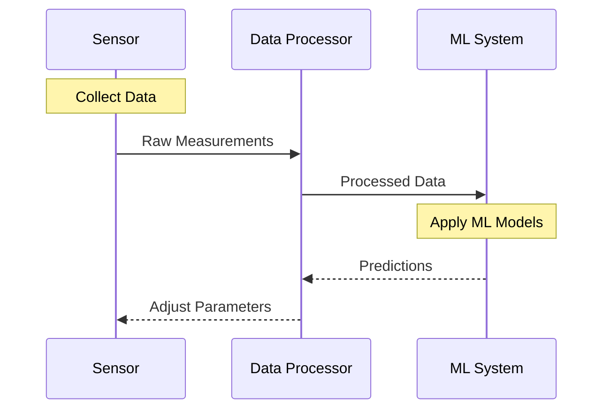
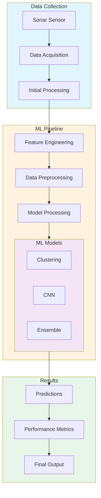
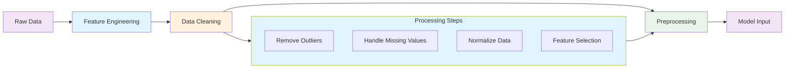
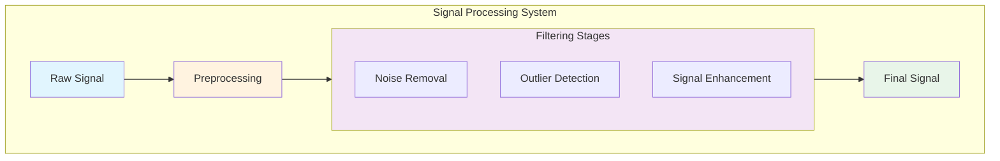
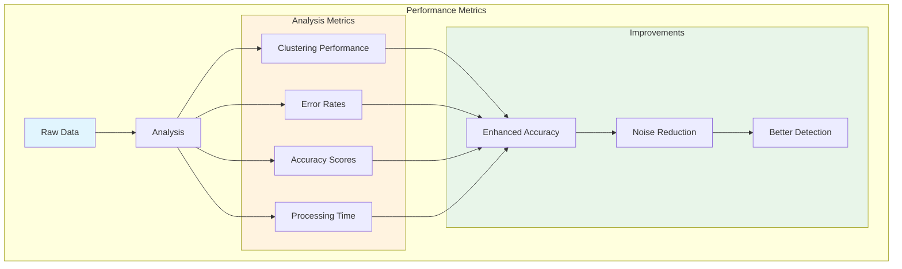
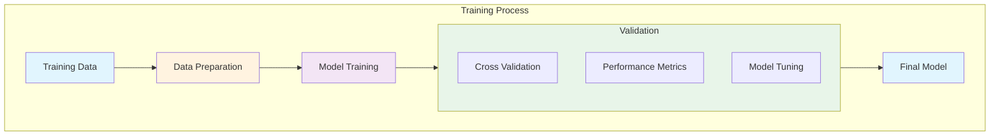
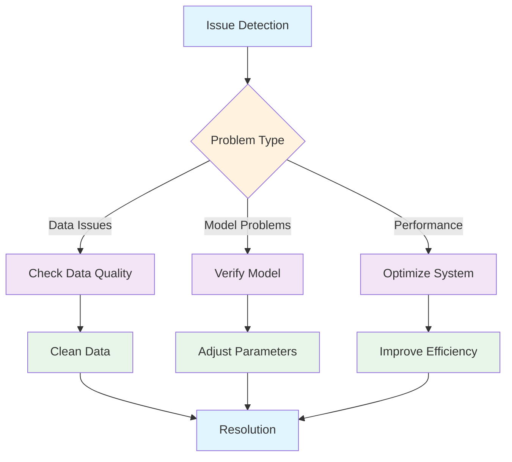

# Enhanced Sonar Sensor Accuracy using Machine Learning

<div align="center">
<h2>Advanced Machine Learning Solution for Sonar Sensor Data Processing</h2>
<p>Created by: Md Khairul Islam</p>
<p>Hobart and William Smith Colleges</p>
<p>Double major in Robotics and Computer Science</p>
</div>

## Table of Contents
- [Overview](#overview)
- [System Architecture](#system-architecture)
- [Data Processing Pipeline](#data-processing-pipeline)
- [Hardware Setup](#hardware-setup)
- [Neural Network Architecture](#neural-network-architecture)
- [Signal Processing](#signal-processing)
- [Performance Analysis](#performance-analysis)
- [Model Training](#model-training)
- [Basic Usage](#basic-usage)
- [Advanced Features](#advanced-features)
- [Troubleshooting](#troubleshooting)

## Overview
This project implements sophisticated machine learning techniques to enhance sonar sensor accuracy, focusing on improving object detection and classification through ensemble clustering and deep learning approaches.

### Basic Operating Principles


## System Architecture


## Data Processing Pipeline


## Neural Network Architecture

```mermaid
flowchart LR
    A[Input Layer] --> B[Conv1D Layer 1]
    B --> C[MaxPool1D]
    C --> D[Conv1D Layer 2]
    D --> E[MaxPool2D]
    E --> F[Flatten]
    F --> G[Dense Layer]
    G --> H[Dropout]
    H --> I[Output Layer]
    
    style A fill:#e1f5fe
    style B fill:#fff3e0
    style C fill:#f3e5f5
    style D fill:#e8f5e9
    style E fill:#f3e5f5
    style F fill:#fff3e0
    style G fill:#e1f5fe
    style H fill:#e8f5e9
    style I fill:#f3e5f5
```


## Signal Processing


## Performance Analysis


## Model Training


## Troubleshooting


## Basic Usage
```python
from sonar_ml_processor import SonarProcessor

# Initialize processor
processor = SonarProcessor()

# Process data
results = processor.process_data(sensor_data)

# Get predictions
predictions = processor.predict(results)
```

## Advanced Features

### Data Processing & Analysis
- Feature Engineering
  - Distance calculations
  - Velocity analysis
  - Acceleration metrics
  - Signal characteristics
- Data Cleaning
  - Outlier removal
  - Noise reduction
  - Missing value handling
- Advanced Processing
  - Signal enhancement
  - Feature selection
  - Dimensionality reduction

### Machine Learning Implementation
- Clustering Algorithms
  - KMeans
  - DBSCAN
  - Spectral Clustering
- Deep Learning
  - 1D CNN architecture
  - Custom loss functions
  - Advanced optimizers
- Ensemble Methods
  - Model combination
  - Weighted voting
  - Prediction aggregation

## Performance Metrics
- Clustering Performance
  - Silhouette score
  - Calinski-Harabasz index
  - Davies-Bouldin index
- Model Accuracy
  - Precision
  - Recall
  - F1-score
- System Efficiency
  - Processing time
  - Memory usage
  - Resource utilization

## Installation

### Requirements
```bash
pandas==2.0.0
numpy==1.24.0
scikit-learn==1.2.2
tensorflow==2.12.0
matplotlib==3.7.1
seaborn==0.12.2
scipy==1.10.1
joblib==1.2.0
```

### Setup
```bash
# Clone repository
git clone https://github.com/yourusername/enhanced-sonar-ml.git
cd enhanced-sonar-ml

# Install dependencies
pip install -r requirements.txt
```

## License

This project is licensed under the MIT License - see the [LICENSE](LICENSE) file for details.

## Support

For issues, questions, or contributions:
- Open an issue on GitHub
- Contact: khairul.robotics@gmail.com

---
Made with 💡 by Md Khairul Islam
